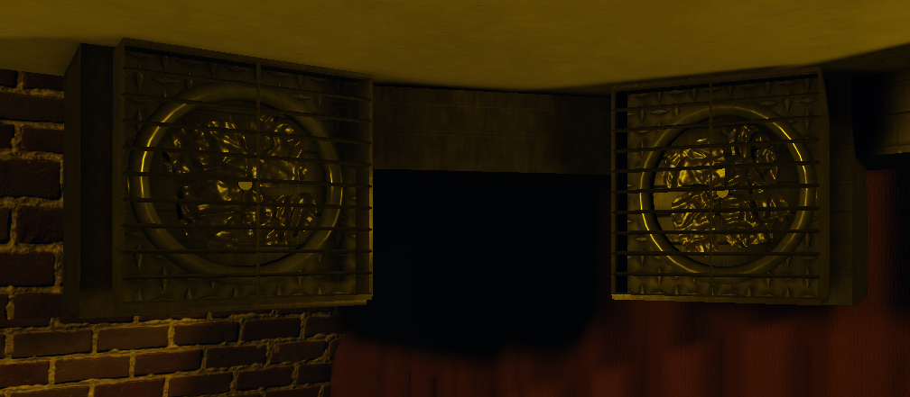
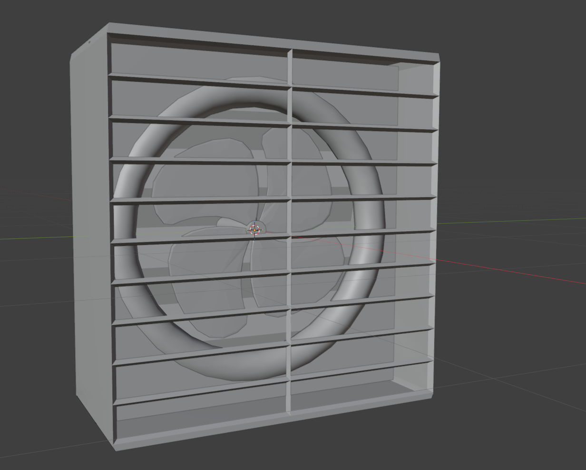
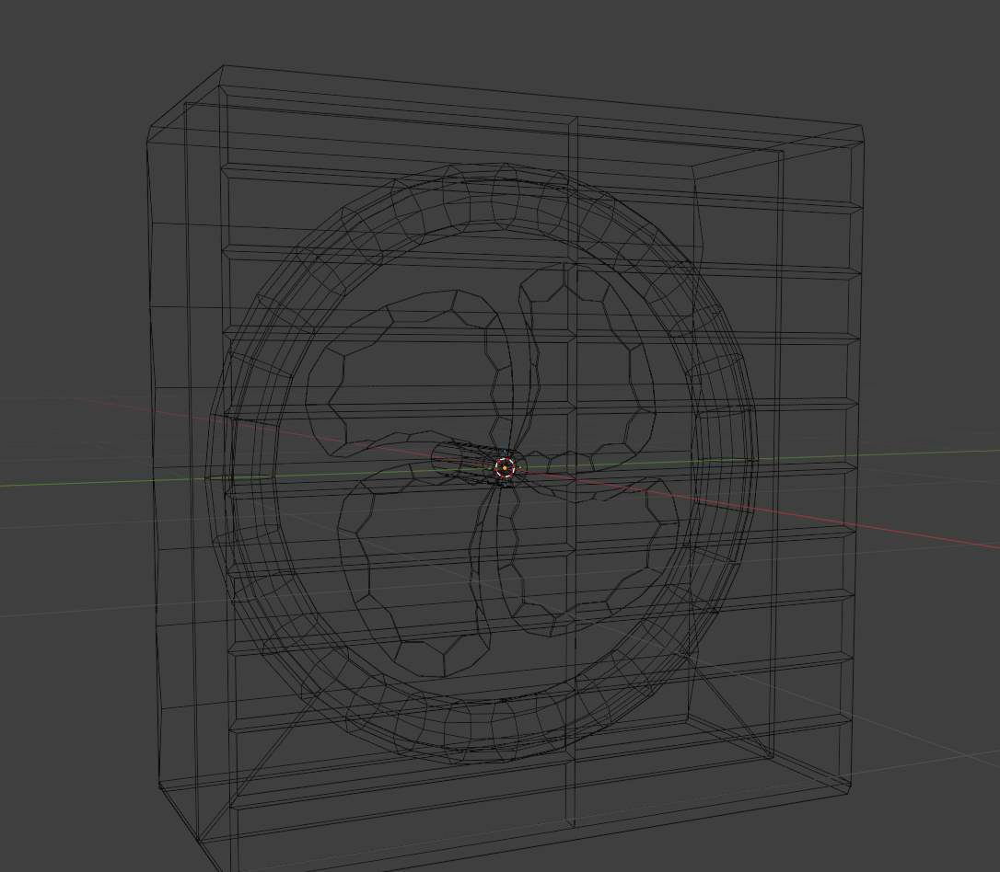
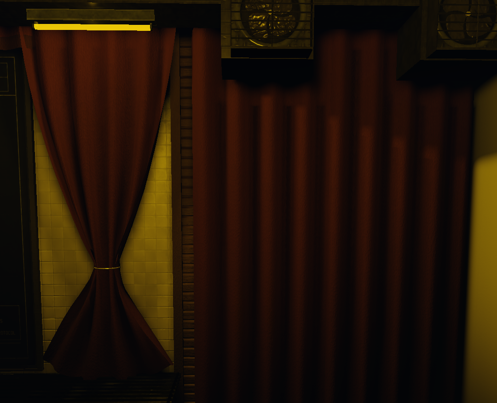
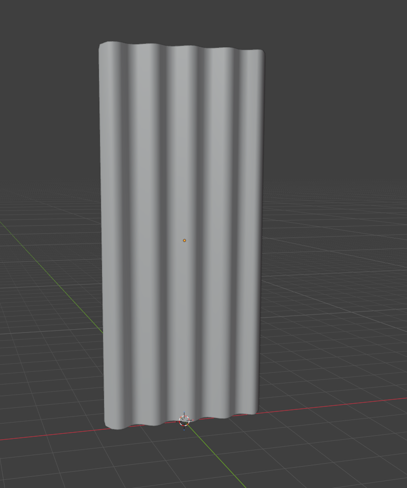
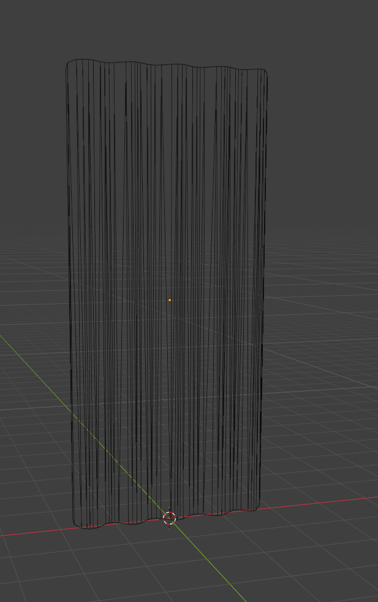

# Modeling Progress

A showcase of my 3D modeling and asset creation work for Roblox environments.

---

## Industrial Ventilation Fan

An industrial ventilation fan created in Blender for use as an environment prop within my facility project.

### In-Game

### Model

### Wireframe

### Model Statistics

| Property | Count |
| --- | ---: |
| Vertices | 1,436 |
| Faces | 1,301 |
| Triangles | 2,728 |
| Objects | 5 |

**Software:** Blender  
**Type:** Industrial / Environment Prop

---

## Curtain

A lightweight curtain model created for use throughout my facility environments.

### In-Game

### Model

### Wireframe

### Model Statistics

| Property | Count |
| --- | ---: |
| Vertices | 84 |
| Faces | 82 |
| Triangles | 82 |
| Objects | 1 |

**Software:** Blender  
**Type:** Environment Prop

---

## About

These assets were created for my Roblox environment development work using Blender.

I focus on creating models that fit the visual style of an environment while keeping geometry suitable for real-time use.

More models will be added as I continue developing and improving my work.
